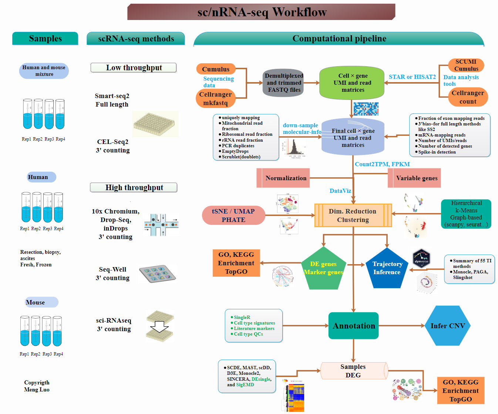

# scRNA-workshop

# Schedule for Single-cell RNA-seq workshop

## Day 1

| Topic  | Instructor |
|:----------:|:--------:|
|[Workshop introduction](../slides/Intro_to_workshop.pdf) | Radhika
|[Introduction to scRNA-seq](../lessons/01_intro_to_scRNA-seq.md) | Mary
|[Single-cell RNA-seq design and methods](../slides/Single_Cell_2_27_20.pdf) | [Dr. Sarah Boswell](https://scholar.harvard.edu/saboswell) |
| Break | |
| [Single-cell RNA-seq design and methods (cont.)](../slides/Single_Cell_2_27_20.pdf) | [Dr. Sarah Boswell](https://scholar.harvard.edu/saboswell) |
| [Raw data to count matrix](../lessons/02_SC_generation_of_count_matrix.md) | Mary |
| Lunch | |
| [R Refresher](https://hbctraining.github.io/DGE_workshop_salmon/lessons/R_refresher.html) | Radhika |
| [Quality control set-up](../lessons/03_SC_quality_control-setup.md) | Jihe |
| Break | |
| [Quality control](../lessons/04_SC_quality_control.md) | Mary |

## Day 2

|  Topic  | Instructor |
|:----------:|:--------:|
| [Theory of Normalization and PCA](../lessons/05_normalization_and_PCA.md) | Radhika |
| [Normalization and Integration](../lessons/06_SC_SCT_and_integration.md) | Mary |
| Break | |
| [Normalization and Integration](../lessons/06_SC_SCT_and_integration.md) | Mary |
| [Clustering](../lessons/07_SC_clustering_cells_SCT.md) | Radhika |
| Lunch | |
| [Clustering](../lessons/07_SC_clustering_cells_SCT.md) | Radhika |
| [Clustering quality control](../lessons/08_SC_clustering_quality_control.md) | Mary |
| Break | |
| [Marker identification](../lessons/09_merged_SC_marker_identification.md) | Jihe |
| [Wrap up](../slides/Workshop_wrapup.pdf) | Radhika |

